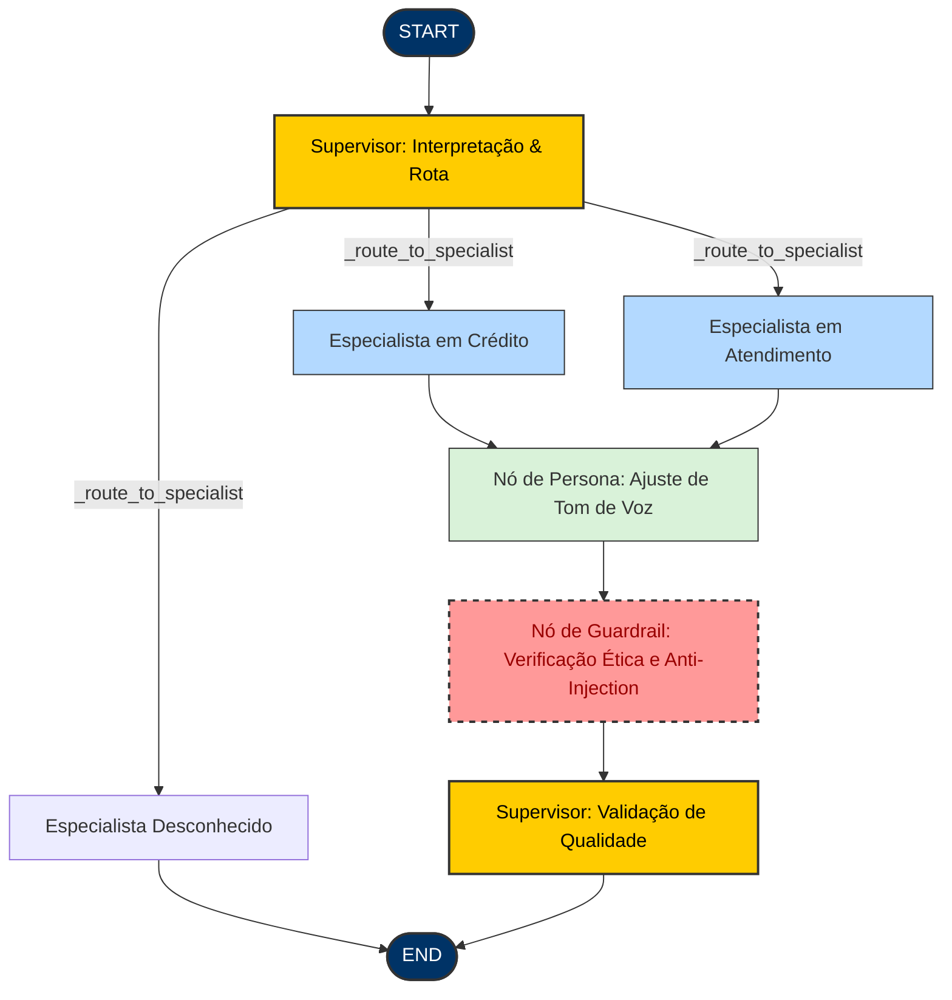

# 🏦 Agentes e Skills - Banco BV

> **Status do Projeto**: Provas de Conceito (PoCs) de IA Generativa e Multiagentes Concluídas e Integradas.

Este repositório consolida as definições, a arquitetura e a implementação prática de soluções de Inteligência Artificial focadas em **Agentes Inteligentes** para o Banco BV. O projeto equilibra **Governança Comportamental (Tom de Voz e Ética)** com **Engenharia e Soluções Técnicas robustas**, criando um ecossistema seguro, resiliente, auditável e focado na melhor experiência do cliente.

---

## 🎯 Pilares da Estratégia de IA

A estratégia do projeto está fundamentada em dois pilares essenciais:

1. **[Governança Comportamental e Soft Skills](docs/objetivos_governanca_comportamental.md)**
   - **Tom de Voz da Marca**: Tradução de diretrizes corporativas (simples, parceiro, seguro, inovador) em personas estruturadas.
   - **Mitigação de Riscos**: Implementação de *guardrails* rígidos para uso ético, evitando desvios, toxicidade ou atuação regulatória inadequada.
   - **Validação com LLM-as-a-Judge**: Avaliações comportamentais e semânticas automatizadas.

2. **[Arquitetura e Soluções de IA](docs/objetivos_arquitetura_solucoes.md)**
   - **Orquestração Inteligente**: Processamento de estado e tomada de decisão descentralizada usando grafos cíclicos.
   - **Buscador Semântico RAG**: Motor de recuperação de documentos vetorizados com banco ChromaDB para embasamento de fatos.
   - **Observabilidade Total**: Rastreamento completo de latência, tokens, aprovações e custos operacionais de chamadas de LLM.

---

## 📐 Arquitetura do Sistema (Multi-Agent StateGraph)

A orquestração do fluxo de conversação é guiada por um **Supervisor Geral** que coordena dois especialistas verticais de domínio (Crédito e Atendimento). A tomada de decisões utiliza a modelagem de grafos de estado (**LangGraph**), garantindo loops de reflexão e auditoria rigorosa de segurança antes que a resposta seja entregue ao cliente.

### Fluxo de Execução do Grafo



---

## 🛠️ Detalhamento das 6 Provas de Conceito (PoCs)

O repositório foi construído de forma incremental através de 6 fases estruturadas de POCs:

### 🔍 [PoC 1: Motor RAG Básico (ChromaDB + LangChain)](docs/specs/poc1_rag_chromadb.md)
* **Objetivo**: Conceder conhecimento especializado de políticas do BV ao agente através de buscas semânticas.
* **Componentes**: `app/rag/knowledge_store.py` e `app/rag/ingestion.py`.
* **Diferenciais**: Estratégia inteligente de fatiamento (*chunking strategy*) com metadados para busca precisa de regulamentos de tarifas, prazos e regras do banco.

### 🧠 [PoC 2: Orquestração Multiagentes com LangGraph](docs/specs/poc2_multiagentes_langgraph.md)
* **Objetivo**: Delegar dinamicamente tarefas complexas a agentes especialistas, mantendo histórico de estado e permitindo loops de reflexão.
* **Componentes**: `app/agents/graph.py` e `app/agents/supervisor.py`.
* **Diferenciais**: Separação total de domínios. O **Supervisor** interpreta a query e delega para o especialista em **Crédito** (`credit_specialist.py`) ou **Atendimento** (`service_specialist.py`), ativando loops de correção se as respostas não forem condizentes.

### 📊 [PoC 3: Observabilidade com Langfuse](docs/specs/poc3_observabilidade_langfuse.md)
* **Objetivo**: Rastreabilidade em tempo real de latência, número de tokens consumidos, custos de inferência e feedback de aprovação (*scores*).
* **Componentes**: Integração nativa de callbacks na inicialização da API em `app/main.py` e chamada do grafo em `app/agents/graph.py`.
* **Diferenciais**: Envio automático de pontuações de aprovação comportamental (`supervisor-approval`) e conformidade de segurança (`guardrail-safety`) a cada requisição processada.

### 🗣️ [PoC 4: Injeção de Persona e Tom de Voz](docs/specs/poc4_persona_tom_de_voz.md)
* **Objetivo**: Consistência da identidade do Banco BV nas comunicações, assegurando empatia, clareza, simplicidade e inovação.
* **Componentes**: `app/agents/persona.py` e `app/agents/prompts.py`.
* **Diferenciais**: Nó centralizado que reescreve ou calibra o tom das respostas geradas pelos especialistas para garantir conformidade com o manual de redação corporativa do banco.

### 🛡️ [PoC 5: Guardrails Éticos e Mitigação de Risco](docs/specs/poc5_guardrails_etico.md)
* **Objetivo**: Bloquear alucinações críticas, vazamento de dados corporativos e tentativas de manipulação maliciosa (*Prompt Injection*).
* **Componentes**: `app/agents/guardrails.py`.
* **Diferenciais**: Validação em duas camadas:
  1. **Input Guard**: Bloqueio de *Prompt Injection* (mensagens pedindo para o agente ignorar as regras).
  2. **Output Guard**: Validação rígida baseada em 3 regras do BV (proibição de aprovar crédito diretamente; proibição de gírias/ofensas; proibição de indicar investimentos de concorrentes). Em caso de violação, responde com uma recusa elegante padronizada.

### 🧪 [PoC 6: Avaliação Automatizada com DeepEval](docs/specs/poc6_avaliacao_deepeval.md)
* **Objetivo**: Garantir qualidade contínua de entrega através do conceito de *LLM-as-a-Judge*.
* **Componentes**: `tests/test_agente_comportamento.py`.
* **Diferenciais**: Suite de testes automatizada avaliando métricas prontas (`Faithfulness` e `AnswerRelevancy`) combinadas a uma **métrica comportamental customizada** que analisa estritamente a aderência ao tom de voz do Banco BV.

---

## 📂 Macro-estrutura do Projeto

O repositório é organizado em quatro macro-módulos principais que segregam responsabilidades cognitivas, de negócio e de engenharia:

* **`/app` (Aplicação Principal)**: Concentra toda a inteligência, regras de negócio e roteamento HTTP da aplicação. Subdividido entre a orquestração do grafo multiagente (`/agents`), o motor de busca semântica (`/rag`), as rotas de API (`/routers`) e a interface interativa (`/templates`).
* **`/docs` (Governança e Especificações)**: Contém a documentação de referência das regras comportamentais, diretrizes do tom de voz institucional e as especificações técnicas de cada PoC.
* **`/tests` (Suite de Validação)**: Armazena a cobertura de testes integrados e a suíte avançada de avaliação automatizada baseada em inteligência artificial (*LLM-as-a-Judge*).
* **`/infra` (Infraestrutura)**: Configurações de orquestração de containers locais para bancos de dados vetoriais e servidores de suporte.

---

## 🛠️ Stack Tecnológica

O ecossistema utiliza as seguintes tecnologias líderes de mercado em IA Generativa:

* **FastAPI**: Backend assíncrono de alta performance e documentação Swagger em `/docs`.
* **LangChain & LangGraph**: Orquestração do pipeline de processamento e estruturação de grafos cíclicos com persistência de estado.
* **ChromaDB (Vector Database)**: Banco vetorial de alta performance executado de forma persistente.
* **Google Gemini AI (`gemini-3.1-flash-lite`)**: Modelo de linguagem de última geração para execução rápida de raciocínio.
* **HuggingFace (`sentence-transformers/all-MiniLM-L6-v2`)**: Gerador de embeddings leves para buscas locais semânticas eficientes.
* **Langfuse**: Solução Open Source de rastreabilidade, telemetria e análise de qualidade de LLMs.
* **DeepEval**: Framework avançado de testes de IA Generativa para validações de produção (*LLM-as-a-Judge*).

---

## 🚀 Guia de Inicialização e Configuração Rápida

Siga os passos abaixo para configurar o ambiente e rodar o projeto localmente na sua máquina (macOS / Linux):

### 1. Requisitos Prévios
Certifique-se de possuir instalado em sua máquina:
* Python 3.10+
* Docker e Docker Compose
* Chave de API do Google Gemini (`GOOGLE_API_KEY`)

### 2. Configurando as Variáveis de Ambiente
Crie um arquivo `.env` na raiz do projeto contendo as credenciais de acesso:

```bash
# Credenciais Google Gemini
GOOGLE_API_KEY="SUA_CHAVE_AQUI"
GEMINI_MODEL="gemini-3.1-flash-lite"

# Credenciais Langfuse (As chaves abaixo são o padrão do container de desenvolvimento local)
LANGFUSE_SECRET_KEY="sk-lf-a7e15da0-8f03-4549-b3fc-d21c2bb4d52e"
LANGFUSE_PUBLIC_KEY="pk-lf-23ceb1b1-41e3-4fb8-9499-5406aaf67dcc"
LANGFUSE_HOST="http://localhost:3000"
```

### 3. Criando o Ambiente Virtual e Instalando as Dependências
Abra o seu terminal e execute:

```bash
# Criar o virtualenv
python3 -m venv .venv

# Ativar o virtualenv
source .venv/bin/activate

# Atualizar o pip e instalar as dependências
pip install --upgrade pip
pip install -r requirements.txt
```

### 4. Inicializando a Infraestrutura de Bancos e Observabilidade
Suba os containers necessários para o monitoramento e o banco vetorial utilizando o Docker Compose:

```bash
docker-compose -f infra/docker-compose.yml up -d
```
> Isso iniciará:
> * **Langfuse Web UI** na porta `http://localhost:3000`
> * **PostgreSQL** (banco do Langfuse) na porta `5432`
> * **ChromaDB** na porta `8000`

### 5. Ingestão de Documentos no RAG (Alimentando o Banco Vetorial)
Antes de rodar a API, envie os dados das políticas internas para o banco vetorial executando o script de ingestão. Você pode fazer isso diretamente via API ou usando um script de inicialização.

Para testar a ingestão automática das políticas iniciais de mock, certifique-se de que a API esteja rodando e use a rota `/knowledge/ingest-default` (detalhada no item a seguir).

### 6. Executando o Servidor de Desenvolvimento
Para iniciar a API do FastAPI, basta rodar o utilitário em shell `dev.sh` (que limpa processos zumbis na porta e inicia o `uvicorn` com recarregamento em tempo real):

```bash
chmod +x dev.sh
./dev.sh
```

A API estará disponível em `http://localhost:8080`.
* A documentação iterativa dos endpoints (Swagger) estará disponível em `http://localhost:8080/docs`.
* A **UI do Painel de Interação de Agentes** estará disponível em `http://localhost:8080/`.

---

## 🎨 Painel Web Interativo (Visualização em Tempo Real)

Ao acessar `http://localhost:8080/` no seu navegador, você terá acesso a um **painel interativo premium e customizado** com as cores do Banco BV. Ele permite:

* Enviar perguntas livres aos agentes.
* Selecionar inputs pré-definidos de teste (violações de ética, atendimento ou crédito).
* **Painel de Rastreabilidade Lateral (Interaction Traces)**: Exibe, de forma colapsável, o passo a passo exato do processamento interno do LangGraph, incluindo:
  * Roteamento do Supervisor
  * Recuperação de fragmentos de RAG pelo especialista
  * Aplicação do tom de voz pela Persona
  * Resultado da análise de Prompt Injection no Guardrail
  * Resultado da validação final do Supervisor

---

## 🧪 Rodando Testes e a Suite de Avaliação DeepEval

Para validar a integridade técnica e comportamental das soluções, execute os comandos descritos abaixo:

### Testes de Unidade e Integrados Gerais
Use o `pytest` para verificar o RAG e as regras estáticas de guardrail ético:

```bash
export PYTHONPATH=$(pwd)
pytest tests/test_guardrails.py tests/test_rag_chain.py tests/test_behavior.py -v
```

### Avaliação Comportamental de Produção (DeepEval LLM-as-a-Judge)
Para rodar a suite de avaliação semântica complexa que utiliza um LLM juiz avançado para garantir fidelidade, relevância e tom de voz perfeito:

```bash
export PYTHONPATH=$(pwd)
pytest tests/test_agente_comportamento.py -v
```
> **Nota**: Este teste realiza chamadas ao LLM para julgar as saídas geradas com base nas métricas de `Faithfulness`, `Answer Relevancy` e no avaliador customizado do tom de voz do Banco BV. Os relatórios de performance podem ser integrados diretamente no painel do DeepEval.

---

## 📊 Visualização de Observabilidade no Langfuse

1. Acesse `http://localhost:3000`.
2. Efetue login com as credenciais padrão de desenvolvimento criadas na sua primeira visita.
3. No menu principal, você poderá inspecionar cada execução do grafo multiagente:
   * **Visualização da árvore de chamadas (Spans e Generações)** do LangGraph.
   * **Gráficos de Custo** baseados nos tokens consumidos do Gemini.
   * **Filtro de Erros e Violações**: Encontre saídas marcadas com a tag `prompt-injection-blocked` ou com score `guardrail-safety = 0.0` para identificar desvios em tempo real.

---

## 🚀 Próximos Passos e Evolução (Roadmap Conceitual)

Visando a transição do ecossistema de testes para um ambiente produtivo resiliente em escala de milhões de clientes, o roadmap técnico prevê a evolução dos seguintes macro-módulos:

* **Banco Vetorial de Produção**: Evolução da infraestrutura vetorial local para clusters distribuídos de banco vetorial em nuvem (ex: Pinecone, Qdrant ou PGVector), garantindo alta disponibilidade, replicação e isolamento de dados.
* **Ingestão Assíncrona (ETL Vetorial)**: Desacoplamento da ingestão de documentos por meio de pipelines de processamento assíncrono (ex: com filas Kafka ou RabbitMQ), suportando arquivos densos sem impactar o tempo de resposta da API principal.
* **Mecanismos de Recuperação Avançada (Advanced Retrieval)**: Implementação de busca híbrida (busca semântica aliada a busca textual por palavra-chave BM25), re-ranking semântico (Cross-Encoders) e contextualização prévia de fatias de texto para maximizar a precisão do RAG.
* **Validação Cognitiva Contínua**: Integração completa da esteira de testes semânticos e juízes automatizados (*LLM-as-a-Judge*) na esteira de integração contínua (CI/CD), prevenindo regressões de persona ou brechas de segurança a cada alteração de prompt.
* **Cache Semântico e Runtime**: Adoção de cache vetorial distribuído (ex: Redis) para armazenar respostas de interações frequentes com similaridade semântica alta, reduzindo custos e tempos de latência nas transições do grafo.

---

### 🛡️ Políticas de Governança Importantes (Guardrails Corporativos)
* **Nunca prometa aprovação imediata**: O Banco BV opera em conformidade técnica de análise de crédito individual de acordo com o perfil de risco.
* **Transparência de Identidade**: O assistente sempre se identificará como um robô inteligente, auxiliando de maneira amigável, transparente e segura.
