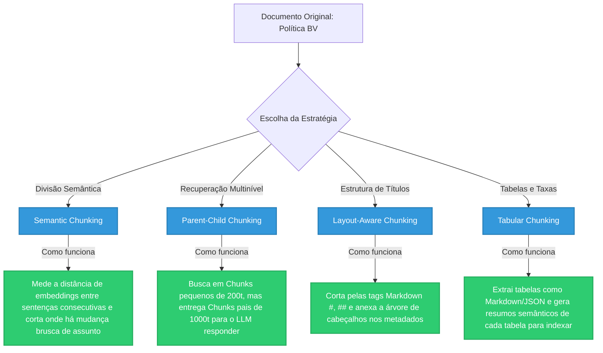

# Estratégia de Chunking Avançada para o RAG do Banco BV

Ao escalar um sistema RAG para produção em cenários bancários, a forma como os documentos (como políticas de crédito, tabelas de tarifas e contratos) são fragmentados (**chunking**) é o fator de maior impacto na qualidade final das respostas do agente. 

Dividir documentos usando métodos ingênuos (ex: fatiar o texto a cada 500 caracteres de forma linear) quebra regras gramaticais, destrói tabelas financeiras e faz com que o agente perca o contexto de seções inteiras.

Abaixo, detalhamos as **5 estratégias avançadas de chunking** projetadas para contornar esses problemas, acompanhadas de exemplos de implementação no ecossistema **LangChain**.

---

## 🛑 O Problema dos Splitters Tradicionais no Contexto Bancário
Os divisores lineares (como `RecursiveCharacterTextSplitter`) agem de forma cega ao conteúdo. Em documentos do Banco BV, isso gera falhas críticas:
*   **Destruição de Tabelas**: Uma tabela de taxas de juros por perfil de cliente é quebrada no meio, misturando valores de linhas e colunas diferentes e fazendo o LLM alucinar sobre taxas.
*   **Perda de Hierarquia**: Uma cláusula específica sobre "crédito consignado" é separada do título principal da seção ("Elegibilidade"). O vetor da cláusula não carrega a palavra "consignado", tornando-a irrecuperável para buscas por esse termo.
*   **Poluição de Contexto ("Lost in the Middle")**: Chunks excessivamente grandes para garantir contexto poluem o prompt do LLM com informações irrelevantes, aumentando a latência (TTFT) e os custos operacionais.

---

## 🎯 As 5 Estratégias Avançadas de Chunking



---

## 1. Semantic Chunking (Divisão Semântica por Tópicos)
Em vez de fatiar o texto por limite de caracteres, o **Semantic Chunker** analisa o significado das frases consecutivas. Ele calcula o embedding de cada sentença e calcula a distância de cosseno entre elas. A divisão ocorre apenas quando há um salto semântico expressivo (mudança de assunto).

*   **Melhor Tipo de Documento**: Manuais de atendimento corridos, normativos institucionais descritivos, relatórios anuais e FAQs longos em formato textual.
*   **Melhor Tipo de Recuperação**: Busca Semântica Densa Convencional (Vetorial Pura).
*   **Formatos de Arquivo Recomendados**: **Texto Corrido (.txt)** e **Word (.docx)**. É excelente para formatos não estruturados de fluxo linear, onde parágrafos contínuos ditam a coesão do conteúdo.

### 📋 Prós e Contras:
| Prós | Contras |
| :--- | :--- |
| **Coesão Natural**: Mantém as ideias completas juntas no mesmo fragmento, evitando cortes sintáticos absurdos. | **Alta Latência/Custo no ETL**: Exige gerar embeddings de cada frase individualmente para calcular as distâncias. |
| **Adaptabilidade**: Ajusta-se dinamicamente a diferentes comprimentos de parágrafo sem necessidade de hardcoding. | **Calibração Sensível**: Exige ajuste fino manual do limiar de divisão (*breakpoint*) para não fragmentar demais ou de menos. |
| **Melhor Geração (LLM)**: O contexto entregue é logicamente isolado, o que reduz ruídos e repetições no prompt. | **Ineficaz em Listas**: Falha em agrupar listas simples de itens ou tabelas que não possuem conexão semântica contínua. |

### Exemplo em LangChain:
```python
from langchain_experimental.text_splitter import SemanticChunker
from langchain_openai import OpenAIEmbeddings

# Inicializa o splitter usando o modelo de embeddings padrão
text_splitter = SemanticChunker(
    OpenAIEmbeddings(model="text-embedding-3-small"),
    breakpoint_threshold_type="percentile"  # Divide nos percentis de maior distância
)

# Executa o chunking semântico
chunks = text_splitter.create_documents([politica_credito_text])
```

---

## 2. Hierarchical / Parent-Child Chunking (Recuperação Multinível)
Esta é a estratégia mais recomendada para conciliar **alta acurácia de busca** com **riqueza de contexto** para geração.

*   **Como funciona**: 
    1. O documento é dividido em grandes chunks pais (**Parent Chunks** - ex: 1500 tokens).
    2. Cada chunk pai é subdividido em vários pequenos chunks filhos (**Child Chunks** - ex: 200 tokens).
    3. Apenas os chunks filhos (altamente específicos) são armazenados e buscados semânticamente no banco vetorial.
    4. Ao encontrar o melhor chunk filho, o sistema recupera seu **ID de Chunk Pai** correspondente do banco e envia o chunk pai completo para o LLM.

*   **Melhor Tipo de Documento**: Políticas de crédito complexas com regras extensas, contratos jurídicos de financiamento, manuais de compliance regulatório.
*   **Melhor Tipo de Recuperação**: Busca Híbrida focada nos fragmentos filhos, mapeando para recuperação do contexto pai.
*   **Formatos de Arquivo Recomendados**: **PDF (com layout complexo/multi-colunas)** e **Word (.docx)**. Ideal para arquivos longos onde cláusulas ou parágrafos específicos precisam ser recuperados isoladamente, mas necessitam de seu contexto circundante integral para a resposta final.

### 📋 Prós e Contras:
| Prós | Contras |
| :--- | :--- |
| **Acurácia Cirúrgica**: Chunks filhos pequenos evitam a diluição semântica do vetor, garantindo alta precisão no matching. | **Complexidade de Banco**: Requer o gerenciamento de dois storages (Vector DB para os filhos + Document/Key-Value Store para os pais). |
| **Mitigação de Alucinação**: O LLM recebe o parágrafo inteiro ao redor da regra, prevenindo respostas fora de contexto. | **Custo de Prompt**: O envio do chunk pai completo consome mais tokens na chamada final ao LLM. |
| **Fim do "Lost in the Middle"**: Supera a limitação de atenção dos LLMs em contextos excessivamente longos. | **Risco de Overlap**: Exige calibração atenta para que o overlap dos filhos cubra limites de frase importantes. |

### Exemplo em LangChain:
```python
from langchain.retrievers import ParentDocumentRetriever
from langchain.storage import InMemoryStore
from langchain_community.vectorstores import Chroma
from langchain_text_splitters import RecursiveCharacterTextSplitter

# 1. Configura os splitters de Pai e Filho
parent_splitter = RecursiveCharacterTextSplitter(chunk_size=1500, chunk_overlap=100)
child_splitter = RecursiveCharacterTextSplitter(chunk_size=200, chunk_overlap=20)

# 2. Inicializa o VectorStore (filhos) e a DocumentStore (pais)
vectorstore = Chroma(
    collection_name="parent_child_bv", 
    embedding_function=OpenAIEmbeddings()
)
store = InMemoryStore()  # Em produção, substituir por RedisStore ou PostgresStore

# 3. Configura o retriever unificado
retriever = ParentDocumentRetriever(
    vectorstore=vectorstore,
    docstore=store,
    child_splitter=child_splitter,
    parent_splitter=parent_splitter,
)

# 4. Adiciona os documentos estruturados
retriever.add_documents(documentos_originais_bv, ids=None)
```

---

## 3. Layout-Aware & Markdown Chunking (Preservação de Hierarquia)
Documentos regulatórios de bancos possuem formatação estrita (Capítulos, Seções, Artigos). O **Layout-Aware Chunking** mapeia essa estrutura física.

*   **Como funciona**: Identifica cabeçalhos Markdown (`#`, `##`, `###`) ou tags de documento estruturado. O splitter divide o arquivo respeitando esses limites e injeta o caminho hierárquico nos metadados de cada sub-chunk.
*   **Vantagem**: Se o chunk recuperar a frase *"O limite máximo é R$ 50.000"*, seus metadados conterão `{"Header_1": "Crédito Pessoal", "Header_2": "Elegibilidade", "Header_3": "Novos Clientes"}`. O LLM saberá com precisão cirúrgica a que se refere o limite.

*   **Melhor Tipo de Documento**: Regulamentos de crédito altamente segmentados por seções/incisos, FAQs estruturadas por tópicos, páginas wiki corporativas.
*   **Melhor Tipo de Recuperação**: Busca Híbrida combinada com Filtros Rígidos de Metadados (*Metadata Filtering*).
*   **Formatos de Arquivo Recomendados**: **Markdown (.md)**, **HTML** e **JSON**. Indispensável para formatos que possuem cabeçalhos semânticos nativos explícitos, permitindo o parsing exato da hierarquia estrutural.

### 📋 Prós e Contras:
| Prós | Contras |
| :--- | :--- |
| **Preservação Contextual**: A hierarquia de tópicos (caminho completo da seção) é anexada diretamente ao metadado do chunk. | **Dependência de Formato**: Exige que o documento original já esteja estruturado (ex: em Markdown limpo ou HTML/PDF formatados). |
| **Filtragem Eficiente**: Permite restringir buscas a pastas ou subcapítulos específicos via metadados antes da busca semântica. | **Desequilíbrio de Tamanho**: Seções curtas geram chunks pequenos e seções longas geram chunks gigantescos que violam limites de tokens. |
| **Rastreabilidade**: Facilita indicar ao usuário final exatamente em qual seção/página da apólice a resposta foi encontrada. | **Sensibilidade a Erros de Sintaxe**: Cabeçalhos mal estruturados no documento quebram a lógica de divisão inteira. |

### Exemplo em LangChain:
```python
from langchain_text_splitters import MarkdownHeaderTextSplitter

markdown_document = """
# Linha de Crédito Veículos
## Condições de Elegibilidade
O cliente deve possuir score de crédito acima de 600.
## Taxas e Tarifas
A taxa mínima de juros é de 1.1% ao mês.
"""

headers_to_split_on = [
    ("#", "Linha_De_Credito"),
    ("##", "Secao"),
]

markdown_splitter = MarkdownHeaderTextSplitter(headers_to_split_on=headers_to_split_on)
md_header_splits = markdown_splitter.split_text(markdown_document)
```

---

## 4. Tabular Chunking (Tratamento de Tabelas de Taxas e Tarifas)
Tabelas financeiras representam o maior calcanhar de Aquiles dos sistemas RAG convencionais.

*   **Como funciona**:
    1.  **Extração Avançada (Layout Parsing)**: Use ferramentas de OCR estruturado (como *LlamaParse* ou *Azure Document Intelligence*) para extrair tabelas de PDFs nativamente no formato **Markdown Table** (`| Juros | Prazo |`) ou **JSON**.
    2.  **Abordagem de Representação Semântica**:
        *   Não crie embeddings apenas a partir do código bruto da tabela (pois as distâncias semânticas de tabelas cruas no formato `| 1.2% | 1.8% |` são imprevisíveis).
        *   **Solução**: Use um LLM leve para gerar um **resumo semântico** em texto da tabela (ex: *"Esta tabela descreve as taxas de juros para financiamento de veículos no Banco BV, variando de 1.1% a 1.9% ao mês para prazos de 12 a 60 meses"*).
        *   Gere o embedding do **resumo** e o armazene vinculando-o ao chunk que contém a **tabela Markdown original**.
        *   Ao buscar, a pergunta do usuário dá *match* com o resumo descritivo, e o retriever puxa a tabela formatada correspondente para alimentar o LLM de geração.

*   **Melhor Tipo de Documento**: Matrizes de tarifas de contas, tabelas de taxas de juros por perfil/prazo, balancetes patrimoniais em PDFs corporativos.
*   **Melhor Tipo de Recuperação**: Busca Híbrida Semântica por Descrição + Casamento Léxico Exato (BM25) de Chaves da Tabela.
*   **Formatos de Arquivo Recomendados**: **PDF (com tabelas e bordas)** e **Markdown (.md - contendo tabelas cruas)**. Vital para PDFs de políticas financeiras que contêm grids de dados embutidos de difícil extração linear.

### 📋 Prós e Contras:
| Prós | Contras |
| :--- | :--- |
| **Dados Íntegros**: Evita a destruição da estrutura relacional de linhas e colunas, impedindo que o LLM embaralhe valores de taxas. | **Custo com APIs de Layout**: Exige o uso de ferramentas pagas ou pesadas de parsing (ex: LlamaParse, Azure Form Recognizer). |
| **Casamento Semântico Preciso**: O resumo textual em linguagem natural casa muito melhor com perguntas coloquiais do que o código bruto. | **Alto Volume de Tokens**: Tabelas Markdown completas consomem rapidamente a janela de contexto do LLM. |
| **Confiabilidade**: Garante que regras que dependem de cruzamento de variáveis (ex: "Idade vs Limite") sejam recuperadas intactas. | **Complexidade de ETL**: Requer uma etapa intermediária assíncrona para chamar o LLM para resumir cada tabela detectada. |

---

## 5. Metadata Enrichment & Self-Querying (Geração de Perguntas Hipotéticas)
Geralmente, o usuário faz perguntas curtas baseadas em intenções (ex: *"Como funciona o financiamento para aposentado?"*), enquanto os documentos corporativos contêm definições técnicas e formais (ex: *"Linha de crédito consignado para beneficiários do INSS"*).

*   **Como funciona**:
    Para cada chunk extraído, passamos o conteúdo por um LLM rápido no pipeline de ETL que gera:
    *   3 perguntas hipotéticas que aquele chunk responde.
    *   Sinônimos chave (ex: "aposentado" para "beneficiário do INSS").
*   **Vantagem**: Concatenamos essas perguntas hipotéticas ao início do chunk antes de gerar o embedding. O embedding de uma pergunta do usuário dará um casamento perfeito com a pergunta hipotética pré-gerada no banco vetorial.

*   **Melhor Tipo de Documento**: FAQs institucionais, guias rápidos de autoatendimento, repositórios de termos de uso de aplicativos.
*   **Melhor Tipo de Recuperação**: Busca Vetorial Pura (similaridade de cosseno aprimorada) ou Auto-Consulta (*Self-Querying Retriever*).
*   **Formatos de Arquivo Recomendados**: **Texto Corrido (.txt)**, **Word (.docx)** e **Markdown (.md)**. Perfeito para formatos diretos de tamanho limitado, facilitando a geração rápida de metadados enriquecidos via LLM sem estourar a janela de tokens de ingestão.

### 📋 Prós e Contras:
| Prós | Contras |
| :--- | :--- |
| **Alinhamento Perfeito**: A pergunta coloquial do usuário bate diretamente com as perguntas hipotéticas formuladas no mesmo tom. | **Alto Custo de Ingestão**: Exige uma chamada de LLM para cada chunk individual no pipeline de ingestão de dados. |
| **Inclusão de Sinônimos**: Permite que o retriever encontre respostas mesmo que termos idênticos não existam no documento corporativo. | **Geração de Ruído**: Se as perguntas hipotéticas forem genéricas demais, podem gerar falsos positivos na busca. |
| **Suporte a Self-Querying**: Facilita a extração automática de filtros pelo LLM (ex: extrair "aposentado" como filtro de metadado). | **Indexamento Lento**: O tempo necessário para processar e indexar novos documentos cresce consideravelmente. |

---

## 📋 Matriz de Decisão de Chunking para o Banco BV

| Tipo de Documento | Estrutura Predominante | Estratégia Recomendada | Por que? |
| :--- | :--- | :--- | :--- |
| **Políticas de Crédito (PDFs de 100+ págs)** | Capítulos, seções e subseções claras | **Layout-Aware + Parent-Child** | Preserva a hierarquia das regras e garante que cláusulas isoladas carreguem o contexto do título principal da seção. |
| **Tabelas de Taxas e Tarifas** | Grades e matrizes financeiras | **Tabular Chunking (Resumos de Tabela + MD)** | Evita a fragmentação linear de tabelas e garante que o LLM receba a tabela estruturada inteira em Markdown. |
| **Manuais de Atendimento / FAQ** | Perguntas e respostas curtas de variados assuntos | **Semantic Chunking + Self-Querying** | Evita que assuntos diferentes fiquem no mesmo bloco e alinha o tom das perguntas dos clientes com os chunks. |
| **Contratos e Termos de Uso** | Parágrafos extensos de texto contínuo | **Semantic Chunking** | Divide o documento com base em mudanças reais de tópico, mantendo a coerência gramatical. |
