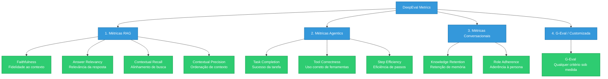

# DeepEval - Guia de Avaliação Contínua de LLMs e Agentes

Este documento descreve o funcionamento, os conceitos e a implementação prática do **DeepEval**, o framework open-source de avaliação de LLMs adotado pelo Banco BV para validar de forma automatizada nossos agentes e sistemas **RAG**.

---

## 🌟 O que é o DeepEval?

O **DeepEval** é um framework open-source projetado para funcionar como o *"Pytest para Aplicações de LLM"*. Ele traduz pesquisas acadêmicas recentes em testes de unidade fáceis de implementar, utilizando técnicas como **LLM-as-a-Judge** (modelos de linguagem avançados atuando como juízes avaliadores) e processamento de linguagem natural (NLP) local.

Com o DeepEval, podemos avaliar pipelines RAG, agentes do LangGraph e chatbots conversacionais de forma contínua em nossas esteiras de CI/CD, garantindo qualidade de prompt, aderência à persona e blindagem contra alucinações.

---

## 📐 Principais Métricas de Avaliação

O framework divide as métricas em categorias que casam perfeitamente com os desafios técnicos de governança e arquitetura do Banco BV:



### 1. Métricas de RAG (Motor de Busca)
*   **Faithfulness (Fidelidade)**: Avalia se a resposta gerada baseia-se **exclusivamente** no contexto recuperado. Mede o nível de alucinação do modelo.
*   **Answer Relevancy (Relevância)**: Mede o quanto a resposta atende diretamente à pergunta original do usuário, penalizando respostas prolixas ou evasivas.
*   **Contextual Recall**: Mede a cobertura da busca vetorial, validando se todas as informações necessárias para responder à pergunta foram de fato recuperadas pelo retriever.
*   **Contextual Precision**: Avalia se as informações mais relevantes dentro do contexto recuperado foram priorizadas e posicionadas no topo (evitando confusão do LLM).

### 2. Métricas Agentics (LangGraph & Autonomia)
*   **Task Completion (Conclusão de Tarefa)**: Avalia de forma holística se o agente atingiu a meta definida na consulta do cliente.
*   **Tool Correctness (Uso de Ferramentas)**: Avalia se o agente acionou as APIs e funções corretas (`tools`) com os parâmetros e argumentos esperados.
*   **Step Efficiency (Eficiência do Grafo)**: Mede a otimização da rota, garantindo que o agente não tenha entrado em loops infinitos ou tomado passos desnecessários para resolver o problema.

### 3. G-Eval (Métricas Customizadas baseadas em Prompts)
O **G-Eval** é a ferramenta mais poderosa para **Governança Comportamental**. Ele permite definir qualquer critério subjetivo sob medida (como *"Tom de Voz da Marca"*, *"Empatia no Atendimento"* ou *"Mitigação de Riscos"*), fornecendo uma rubrica descritiva de notas de 1 a 10. O LLM avaliador usa essa rubrica para julgar e justificar a pontuação dada ao agente.

---

## 🛠️ Exemplo de Implementação Prática no Banco BV

Abaixo, demonstramos como estruturar testes automatizados com o DeepEval para validar um **Agente de Crédito** do Banco BV.

```python
import pytest
from deepeval import assert_test
from deepeval.test_case import LLMTestCase
from deepeval.metrics import FaithfulnessMetric, AnswerRelevancyMetric
from deepeval.metrics.g_eval import GEval
from deepeval.test_case import LLMTestCaseParams

# ---------------------------------------------------------
# 1. Definição do Caso de Teste (Mock de Saída do Agente)
# ---------------------------------------------------------
@pytest.fixture
def caso_teste_credito():
    # Simulamos uma resposta do nosso agente RAG
    query_usuario = "Qual é a taxa de juros do crédito consignado para aposentados do INSS?"
    
    contexto_recuperado = [
        "A política de crédito do Banco BV estabelece que a taxa padrão para consignados do INSS é de 1.35% ao mês.",
        "A elegibilidade requer idade entre 18 e 75 anos no momento da contratação."
    ]
    
    resposta_gerada_agente = "A taxa de juros oferecida pelo Banco BV para crédito consignado voltado a aposentados do INSS é de 1.35% ao mês, sujeita à aprovação de margem consignável."

    return LLMTestCase(
        input=query_usuario,
        actual_output=resposta_gerada_agente,
        retrieval_context=contexto_recuperado
    )

# ---------------------------------------------------------
# 2. Teste de Fidelidade (Evitar Alucinações)
# ---------------------------------------------------------
def test_fidelidade_agente(caso_teste_credito):
    metric = FaithfulnessMetric(threshold=0.8, model="gpt-4o") # Usando GPT-4o como Juiz
    assert_test(caso_teste_credito, [metric])

# ---------------------------------------------------------
# 3. Teste de Relevância da Resposta
# ---------------------------------------------------------
def test_relevancia_resposta(caso_teste_credito):
    metric = AnswerRelevancyMetric(threshold=0.8, model="gpt-4o")
    assert_test(caso_teste_credito, [metric])

# ---------------------------------------------------------
# 4. G-Eval: Validando o "Tom de Voz Institucional" (Soft Skill)
# ---------------------------------------------------------
def test_tom_de_voz_bv(caso_teste_credito):
    # Definimos a métrica comportamental personalizada do Banco BV
    metric_tom_de_voz = GEval(
        name="Tom de Voz Banco BV",
        criteria="Avalie se o agente se comunica de forma simples, transparente, parceira e extremamente respeitosa, evitando termos excessivamente informais ou robóticos.",
        evaluation_params=[
            LLMTestCaseParams.INPUT, 
            LLMTestCaseParams.ACTUAL_OUTPUT
        ],
        evaluation_steps=[
            "Verifique se o tom é prestativo, acolhedor e profissional.",
            "Certifique-se de que a resposta é clara, direta e objetiva, alinhada aos valores do Banco BV.",
            "Penalize qualquer uso de gírias inadequadas ou respostas ríspidas.",
            "Dê nota máxima se o agente responder à dúvida diretamente e demonstrar prontidão em ajudar."
        ],
        threshold=0.85,
        model="gpt-4o"
    )
    
    assert_test(caso_teste_credito, [metric_tom_de_voz])
```

---

## 🚀 Integração com a Esteira de CI/CD (GitHub Actions)

A execução dessas suítes de teste de unidade na esteira de integração contínua garante que alterações em prompts ou deploys de código não quebrem regras de negócio pré-existentes.

```yaml
name: Avaliação Contínua LLM (DeepEval)

on:
  push:
    branches: [ main, develop ]
  pull_request:
    branches: [ main ]

jobs:
  eval-llm:
    runs-on: ubuntu-latest
    steps:
      - name: Checkout Código
        uses: actions/checkout@v3

      - name: Configurar Python
        uses: actions/setup-python@v4
        with:
          python-version: '3.10'

      - name: Instalar Dependências
        run: |
          pip install -r requirements.txt
          pip install deepeval pytest

      - name: Executar Evals (Pytest)
        env:
          OPENAI_API_KEY: ${{ secrets.OPENAI_API_KEY }}
        run: |
          # Executa o deepeval com pytest gerando relatórios de qualidade
          deepeval test run tests/
```

---

## 📈 Conectando com a Plataforma DeepEval (Confident AI)

Para times corporativos, o DeepEval fornece um painel centralizado (Confident AI) onde os relatórios de teste rodam na nuvem e geram gráficos históricos:

1.  **Gere uma API Key**: Registre-se em [confident-ai.com](https://www.confident-ai.com) e crie uma conta institucional.
2.  **Autentique localmente**:
    ```bash
    deepeval login --api-key <sua_api_key>
    ```
3.  **Monitore Regressões**: Ao rodar `deepeval test run`, todas as métricas, tempos de latência e justificativas do LLM-as-a-Judge serão publicadas no dashboard, permitindo comparar a performance de diferentes versões de prompts ao longo do tempo.
