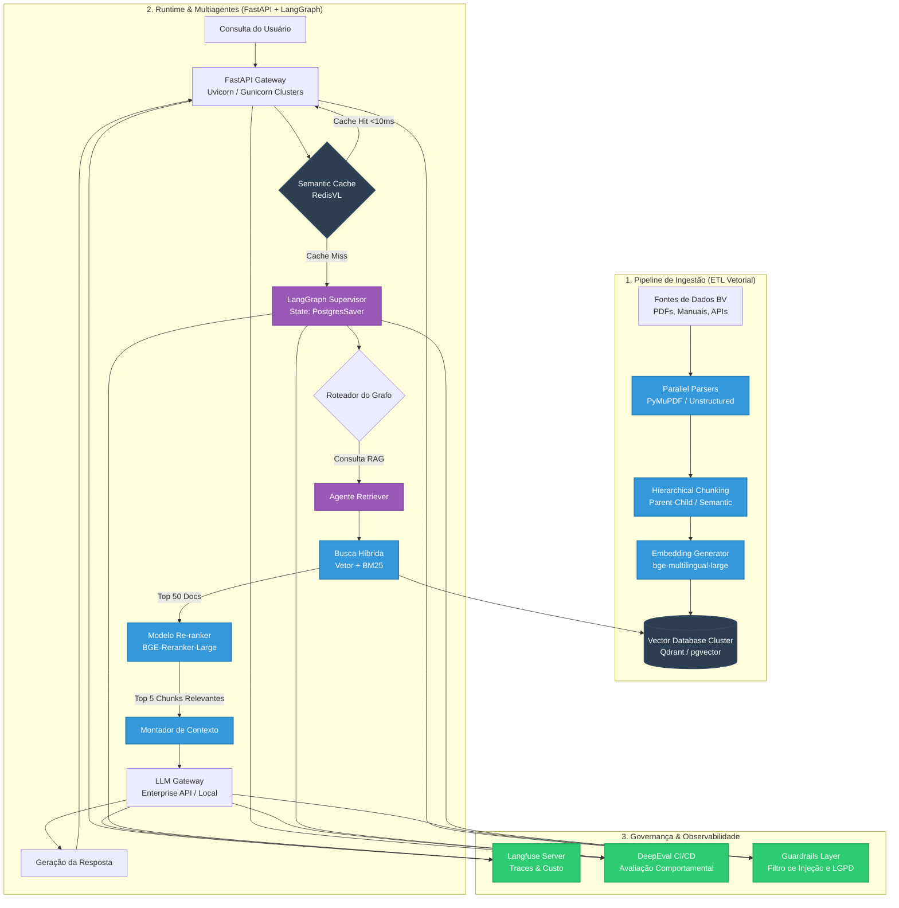

# Arquitetura de RAG Corporativo em Larga Escala (Production-Grade)

Este documento descreve a estratégia e a arquitetura técnica recomendadas para escalar o motor **RAG (Retrieval-Augmented Generation)** do Banco BV, evoluindo a solução a partir da **PoC 1 (ChromaDB + LangChain local)** para um ecossistema corporativo distribuído de alta performance, resiliente e seguro.

---

## 🗺️ Visão Geral da Arquitetura

Para suportar milhões de documentos, milhares de consultas simultâneas de clientes e garantir conformidade com políticas internas e LGPD, a arquitetura RAG deve ser modularizada em três pilares fundamentais: **Pipeline de Ingestão (ETL Vetorial)**, **Runtime de Orquestração com Baixa Latência** e **Ciclo de Governança & Observabilidade**.

---

## 🗄️ 1. O Banco Vetorial em Produção: Evoluindo o ChromaDB

Embora o ChromaDB seja excelente para prototipagem e desenvolvimento local (PoCs), ele apresenta limitações de escalabilidade horizontal em cenários corporativos sob alta concorrência de leitura e escrita.

### Alternativas Recomendadas para Produção:
1. **Qdrant ou Milvus (Especializados em Produção)**:
   - **Por que?** São bancos de dados vetoriais nativos em nuvem (*cloud-native*), escritos em linguagens de alta performance (Rust/Go), com suporte nativo a sharding, replicação ativa, busca escalável e filtragem de metadados avançada em tempo real.
   - **Indicado para**: Grandes volumes de dados distribuídos globalmente com requisitos rígidos de SLA (sub-50ms).
2. **pgvector (Extensão para PostgreSQL)**:
   - **Por que?** O Banco BV já utiliza PostgreSQL em diversas infraestruturas (como visto na própria dependência do Langfuse). Utilizar a extensão `pgvector` permite unificar o banco de dados relacional e vetorial.
   - **Benefícios**: Suporte total a transações ACID, facilidade de backup/restore corporativo e indexação rápida usando algoritmos **HNSW** (Hierarchical Navigable Small World).
   - **Indicado para**: Projetos que necessitam manter a infraestrutura simplificada e integrada aos sistemas transacionais legados.

---

## 🔄 2. Ingestão de Dados Resiliente (ETL Vetorial)

Alimentar um RAG com milhões de páginas requer uma esteira de dados robusta e assíncrona, evitando gargalos de CPU e estourar os limites de taxa de chamadas (*rate limits*) de APIs de embeddings.

*   **Processamento Assíncrono com Workers**: Utilização de **Celery** (com Redis/RabbitMQ) ou **Apache Spark/Ray** para processar documentos em paralelo em múltiplos containers.
*   **Indexação Incremental (Delta Indexing)**:
    - Evita o reprocessamento completo do corpus de documentos.
    - Implementação de um sistema de hashes (MD5/SHA256) por arquivo e por chunk. Se o documento não foi alterado, o processo de embedding é ignorado.
*   **Estratégias Avançadas de Chunking**:
    - **Hierarchical / Parent-Child Chunking**: Dividimos o documento em pequenos pedaços (ex: 200 tokens) para a busca vetorial de alta precisão (Retrieval), mas recuperamos e injetamos o chunk pai (ex: 1000 tokens) no LLM para garantir o contexto completo (Generation).
    - **Semantic Chunking**: Em vez de usar divisões por caracteres rígidos, dividimos o texto com base em mudanças reais de tópico, calculando a distância semântica entre sentenças consecutivas.

---

## 🔍 3. Otimização de Busca e Recuperação (Advanced Retrieval)

A busca semântica simples (Cosine Similarity pura) falha frequentemente em cenários bancários devido à presença de termos específicos, códigos de transação ou tabelas de taxas.

### Técnicas Indispensáveis:
1. **Busca Híbrida (Hybrid Search)**:
   - Combina a **Busca Vetorial (Dense Retrieval)**, que captura o contexto semântico geral, com a **Busca Lexical (BM25 - Sparse Retrieval)**, ideal para encontrar palavras-chaves exatas, IDs de contratos e códigos de produtos.
   - Os resultados são combinados usando **RRF (Reciprocal Rank Fusion)** para obter um score único de relevância.
2. **Re-ranking (Cross-Encoders)**:
   - Os Bi-Encoders de embeddings normais sacrificam precisão em prol da velocidade na geração de vetores de busca rápida.
   - Introduzimos um modelo de **Re-ranking** (ex: *BGE-Reranker-Large* ou *Cohere Rerank*) que recebe as 50 melhores correspondências geradas pela busca híbrida e executa uma comparação atenciosa profunda de relevância.
   - Apenas o top 3 ou top 5 reclassificados (com relevância máxima comprovada) são enviados ao LLM. Isso reduz drasticamente os tokens consumidos e previne o fenômeno de alucinação do modelo.
3. **Query Expansion & HyDE (Hypothetical Document Embeddings)**:
   - O agente LLM reescreve a pergunta do usuário em múltiplos formatos ou gera uma resposta hipotética preliminar antes da busca. O vetor dessa resposta fictícia é usado para buscar os documentos reais, aumentando a probabilidade de um casamento semântico perfeito.

---

## 🚀 4. Escalabilidade de Runtime (FastAPI + LangGraph)

Para atender a milhares de usuários mantendo latência e custos sob controle no ambiente FastAPI/LangGraph:

*   **Cache Semântico (Semantic Caching)**:
    - Utilização de **Redis** com **RedisVL**.
    - Antes de consultar o banco vetorial ou chamar o LLM, o sistema vetoriza a pergunta do usuário e busca no cache por perguntas semanticamente idênticas ou muito próximas (ex: similaridade > 0.95).
    - Se houver match, a resposta é entregue instantaneamente (<10ms) sem custo de LLM.
*   **Persistência Distribuída de Estado (LangGraph Checkpointing)**:
    - Por padrão, o LangGraph utiliza `MemorySaver` (em memória) para persistir o histórico de conversas dos agentes. Isso impede que os containers da API escalem horizontalmente (pois o estado fica preso na memória de uma única instância).
    - **Ação**: Substituir `MemorySaver` por **`PostgresSaver`** (utilizando o banco PostgreSQL compartilhado) ou **`RedisSaver`**, permitindo que qualquer instância da API FastAPI atrás de um Load Balancer atenda a qualquer requisição do usuário de forma stateless.
*   **Orquestração Assíncrona Total**:
    - Garantir que todos os componentes da API e dos nós do LangGraph sejam `async`/`await`.
    - Chamadas de rede e inferências de LLM devem utilizar os métodos assíncronos (`ainvoke`, `abatch`, `astream_events`) para evitar o bloqueio da thread principal do Uvicorn.

---

## 🛡️ 5. Observabilidade e Governança Contínua (Langfuse & DeepEval)

RAG corporativo escalado necessita de auditoria robusta para evitar riscos comportamentais e custos descontrolados.

*   **Telemetry com Langfuse**:
    - Rastreamento em tempo real do custo exato por consulta (tokens de prompt vs geração).
    - Detecção de gargalos de latência por nó (ex: se o gargalo está no banco vetorial, no re-ranker ou no LLM).
*   **Pipeline de Avaliação (CI/CD)**:
    - Integração de testes automatizados com **DeepEval** na esteira de deploy.
    - Medição de KPIs críticos para o RAG:
        1. **Context Recall**: O retriever está trazendo todas as informações necessárias?
        2. **Context Precision**: As informações trazidas são realmente relevantes para a pergunta?
        3. **Faithfulness (Fidelidade)**: A resposta gerada baseou-se estritamente no contexto recuperado (mitigando alucinação)?
        4. **Answer Relevancy**: A resposta responde diretamente ao que o usuário perguntou?
*   **Guardrails de Entrada/Saída (Security)**:
    - Filtro ativo contra injeção de prompt e vazamento de PII (Informações Pessoais Identificáveis) usando modelos de classificação leve localizados antes do fluxo principal do agente.
